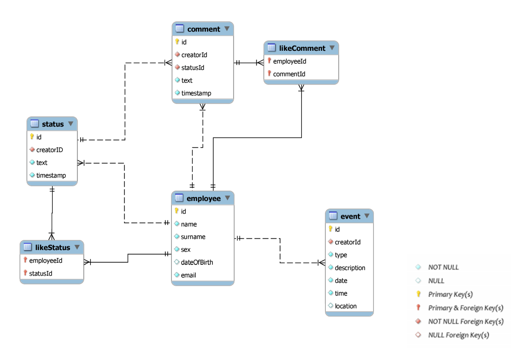

# Submission for Coursework 1 in the Databases module at King's College London.

The goal is to create a database based on the ER diagram below.

After connecting to the SQL database, the files should be executed by the following order:

1. schema.sql
2. insert.sql
3. view.sql
4. select.sql
5. update.sql
6. delete.sql

The requirements for the coursework is below:

### 1 Schema Definition.

Based on the design and requirements above, write the required SQL DDL
(Data Definition Language) statements (i.e. CREATE TABLE) to create the corresponding
tables. Ensure that:

• Table and attribute names do not conflict with SQL reserved words

• Attribute data types are core SQL data types as described in the lectures

• Your tables implement entity, referential and domain constraints as needed

• Every table has a primary key specified as it corresponds to your relational model

• All foreign keys are properly declared

### 2 Populate Database with data. 

Time to get creative! Populate your database with some data
that you will come up with on your own. Since you only require a small test sample of data,
use SQL INSERT statements to populate your database. More precisely:

• Pick at least 3 of your favourite celebrities to include as Employees. Make up the
DOB/Email for these Employees.

• Include at least 3 Status per each Employee.

• Create at least 2 Comments per each Status.

• Include at least 4 Likes per Employee. There should be at least one like status and one
like comment.

• Include at least 3 business Events and 3 social Events spread out throughout the months
of January and February for this year.

Write your INSERT statements in the provided template file: insert.sql

### 3 Creating views. 

Write SQL statements to:

• Produce a view that returns the events in the future and rejects any attempt to insert
or update events in the past.

• Write a simple statement to test rejection.

Write all of these SQL statements in the above order in the provided template file: view.sql

### 4 Querying the Data. 

Write the SELECT statements that to obtain the following queries:

• 4.1. Employee List. Produce a list of names and emails of all employees.

• 4.2. Oldest Status. Fetch the text of the oldest status shared in the social network.

• 4.3. Total Usage. The company would like to know how successful the social network 
is, i.e., how many status, comments and events have been shared in total in the social
network. Write a SELECT query the gives the total number of status, comments and
events.

• 4.4. Event Report. List the total number of events created by event type for the month
of February.

• 4.5. Comment Report. The company would like to know how much each employee is
commenting in the social network; that is, how many comments have been shared by
each employee. In the listing, include the employees that have not participated (i.e. they
have made 0 comments).

• 4.6. Number 1 and 2. The company would like to personally email its top 2 employees by
total number of comments and status. Write a SELECT query that lists his Employee’s
Name, Surname and Email. Sort the employees by their number of status and comments,
showing the top-participating employee first.

• 4.7. Most Controversial Employee. List the information about the employee who has
written the most commented status. Note there may be more than one most controversial
employee.

Write all of these SELECT statements in the above order in the provided template file:
select.sql

### 5 Updating the Data. 

Write the UPDATE statements to perform the following operations:

• 5.1. To clarify the distinction between business events and social events, the company
would like to define that any event occurring after 5 pm is a social event. Create an
update query to make that any business event occurring after 5pm is a social event.

• 5.2. Note that it is not possible to comment a status before the status was created.
Create an update query to make that all comments violating this constraint have a
timestamp equal the commented status timestamp plus one second.

Write these UPDATE statements in the provided template file: update.sql

### 6 Removing Data from the Database. 

Write the DELETE statements to perform the following
operation:

• The most controversial employee has left the company. This employee has become upset
to find out that the company was storing and analysing all of their communications
with other employees. They have demanded to have all of their data removed from the
Social Network database. Write the DELETE statement(s) that removes this employee,
identified by their email address, from the database. To avoid any future embarrassment
in case of a data leak, make sure you remove all trace of the employee from the database.
If you don’t know the email for the most controversial employee, you can assume it is
any employee identified by their email.

Write all of these DELETE statements in the provided template file: delete.sql.
